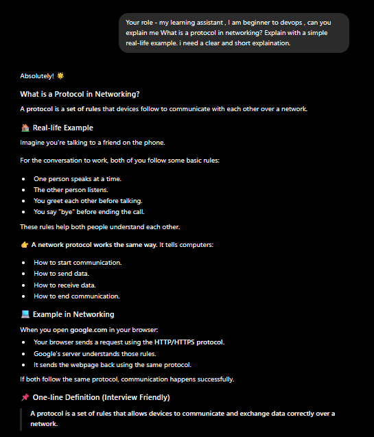
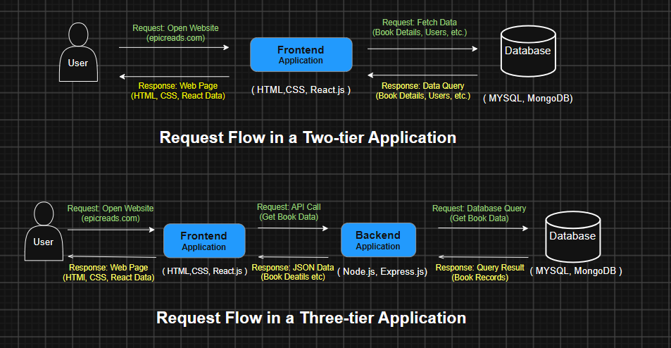
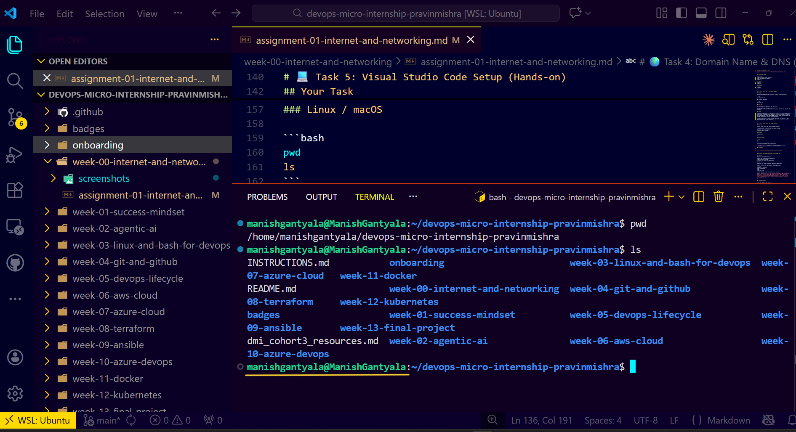

# Week 00 - Internet and Networking

Part of the DevOps Micro Internship (DMI) Cohort 3 with Agentic AI

---

# 🧑‍💻 Task 1: Using ChatGPT as Your Learning Assistant

## Scenario

You're new to DevOps and will frequently encounter technical questions. ChatGPT can be your learning companion.

## Your Task

Write a clear ChatGPT prompt to help you understand:

> "What is a protocol in networking? Explain with a simple real-life example."

Take a screenshot of your interaction showing:

* Your detailed prompt (with clear expectations)
* ChatGPT's simplified response with an example

## Screenshot



---

## What I Learned (2–3 lines)

By taking the help of ChatGPT as a learning assistant, it helped me understand the concepts through real-world scenarios. I also learned that the prompt should be clear and follow the required instructions to get better explanations. I learned that communication between two devices works only when both follow the same rules. Just like two people need to speak the same language to understand each other, computers also follow the same rules to exchange information. Whenever I access a website, my computer and the server communicate by following these rules.


# 🌐 Task 2: Internet and Networking

## Scenario

Your friend is launching an online bookstore named **EpicReads**.

He asked you to explain how users globally can access his website hosted in Finland.

## Your Task

Write a short explanation (**100–150 words**) that includes:

* Packet Switching
* IP Address
* TCP/IP
* HTTP/HTTPS

💡 **Tip:** You may use ChatGPT (as demonstrated in Task 1) to refine your explanation.

## Answer

When a user from India opens epicreads.com, which is hosted in Finland, the browser first needs to know where the website is located. It uses the website's IP address, which works like a house address and helps the request reach the correct server in Finland. To communicate with the server, both the user's computer and the server follow TCP/IP, a set of communication rules that ensures the request reaches the destination correctly and the response is received in the right order. During this communication, the data is divided into small pieces using Packet Switching so it can travel efficiently across the network and be combined back into the original data when it reaches the destination. Finally, the web browser and the server use HTTP to exchange the website's content, while HTTPS secures and encrypts the communication so the data remains protected during transmission.

---

# 🏗️ Task 3: Application Architecture & Stack

## Scenario

EpicReads bookstore has two application versions:

### Two-Tier Application

* Frontend
* Database

### Three-Tier Application

* Frontend
* Backend
* Database

## Your Task

* Draw simple diagrams (hand-drawn or tool-based such as draw.io)
* Label each layer clearly
* List at least two common technologies or tools used for each layer
* Submit a screenshot or photo clearly showing your own drawing

## Diagram Screenshot / Photo


---

## Technologies Used

### Frontend

* HTML (HyperText Markup Language)
* CSS (Cascading Style Sheets)
* React.js

### Backend

* Node.js
* Express.js

### Database

* MySQL
* MongoDB

---

# 🌍 Task 4: Domain Name & DNS (Basic Concepts)

## Scenario

Your friend's bookstore **EpicReads** is currently accessible through:

```text
52.172.142.222:3000
```

He purchased the domain:

```text
epicreads.com
```

## Your Task

In **50–100 words**, explain in your own words:

1. What is DNS (Domain Name System)?
2. Which DNS record type should be used to connect the domain to the given IP, and why?

## Answer

* Domain Name System(DNS): It is a system that converts a human-readable domain name into an IP address. It allows users to access a website using a domain name instead of remembering its IP address. For example, instead of accessing the bookstore using 52.172.142.222:3000, users can simply enter epicreads.com, and DNS automatically finds the correct IP address.

* An A record is used to connect a domain name to an IPv4 address. It maps epicreads.com to 52.172.142.222, so users can access the bookstore using the domain name instead of the IP address.

---

# 💻 Task 5: Visual Studio Code Setup (Hands-on)

## Your Task

Install Visual Studio Code (if not already installed).

Take a screenshot of your VS Code environment showing:

* Terminal open inside VS Code
* Running a basic command:

### Windows

```powershell
dir
```

### Linux / macOS

```bash
pwd
ls
```

* Your selected VS Code theme clearly visible

⚠️ **Important:** The screenshot must show your username or another identifiable detail to confirm it is your environment.

## Screenshot




---

# 🔗 Task 6: Publish Your Assignment as a LinkedIn Post

## Objective

Publishing on LinkedIn helps you:

* Build your professional online presence
* Reinforce your learning
* Document your DevOps journey publicly

## Your Task

Summarize your answers from Tasks 1–5 into a LinkedIn post.

Clearly structure your post into the following sections:

* ChatGPT
* Internet & Networking
* App Architecture
* DNS
* VS Code Setup

Add the following credit note at the end of your post:

> **P.S. This post is part of the DevOps Micro Internship (DMI) with Agentic AI — Cohort 3 — by Pravin Mishra. My graded progress is public: https://dmi.pravinmishra.com/s/YOUR-GITHUB-USERNAME.html · Start your DevOps journey: https://dmi.pravinmishra.com/?utm_source=student&utm_medium=ps-linkedin&utm_campaign=cohort3**

---

## LinkedIn Post URL

Paste your LinkedIn post URL here:

```text
https://www.linkedin.com/posts/manish-gantyala_dmibypravinmishra-devops-networking-ugcPost-7489383203569352704-mpvy/?utm_source=share&utm_medium=member_desktop&rcm=ACoAADqt21EB4eFz2Y0PwHT2lP9NrT7NlvawSpw
```

---

## LinkedIn Post Backup Copy

Paste the full text of your LinkedIn post here:

🌐 I typed epicread,com into the browser and pressed Enter.

A webpage appeared almost instantly.

I've done this thousands of times, but this time I paused to think about everything that happened before the page appeared.

I've come across concepts like DNS, IP Address, TCP/IP, Packet Switching, and HTTP/HTTPS many times. What changed this week wasn't learning new terms—it was following one website request from start to finish instead of treating each concept separately.

🔄 Type epicreads,com → 🌍 DNS resolves the domain to an IP address → 🤝 TCP/IP establishes the connection → 📦 Packet Switching carries the data across the network → 🔒 HTTP/HTTPS exchanges the request and response → 🖥️ The browser renders the webpage.

Seeing the entire flow made the concepts feel connected rather than isolated.

🏗️ The same perspective carried over to application architecture.

The request doesn't stop once it reaches the server. It continues through the frontend, backend, and database, where each layer has a clear responsibility before the response makes its way back to the browser.

Earlier, I focused on the layers.

Now I focus on how a request moves through them.

🤖 One thing that also changed was the way I used ChatGPT.
I'd ask questions like,

"𝘐𝘧 𝘱𝘢𝘤𝘬𝘦𝘵𝘴 𝘤𝘢𝘯 𝘢𝘳𝘳𝘪𝘷𝘦 𝘰𝘶𝘵 𝘰𝘧 𝘰𝘳𝘥𝘦𝘳, 𝘩𝘰𝘸 𝘥𝘰𝘦𝘴 𝘮𝘺 𝘣𝘳𝘰𝘸𝘴𝘦𝘳 𝘬𝘯𝘰𝘸 𝘸𝘩𝘪𝘤𝘩 𝘱𝘪𝘦𝘤𝘦 𝘤𝘰𝘮𝘦𝘴 𝘧𝘪𝘳𝘴𝘵?"

The answer led me to TCP sequence numbers, and suddenly packet switching wasn't just another networking topic anymore.

It finally had a reason to exist.

💻 That same way of thinking carried into my development environment.

VS Code stopped feeling like just an editor. It became the place where the whole flow—from frontend to backend to database—comes together while building, debugging, and experimenting.

One thing I'll carry forward is this:

When I stop looking at technologies individually and start following the complete flow, everything becomes easier to reason about.

💬 Following one complete request changed the way I looked at networking.
What's one concept you thought you understood until you had to actually use it?
I'd love to hear your perspective.

P.S. This post is part of the DevOps Micro Internship (DMI) — Self-Paced Engineer Track — by Pravin Mishra. 
My graded progress is public: https://lnkd.in/dRtxpAKW
Start your DevOps journey: https://lnkd.in/d8FWehp3
---

# Reflection – Week 0

### What did you find easy?

As a DevOps enthusiast, I liked the explanations of the concepts because they helped me understand them better with real-world examples. I am always interested in learning new tools.

---

### What was difficult?

I always wanted to understand how the Internet actually works, but initially it was difficult because of my lack of knowledge. Practicing the concepts practically added more value and made them easier to understand.

---

### What will you improve next week?

I will keep focusing on learning things practically instead of relying only on theoretical concepts. I want to gain more practical exposure throughout my learning journey.
---

## 📌 About DMI & CloudAdvisory

DevOps Micro Internship (DMI) is a project-based DevOps program run by Pravin Mishra (The CloudAdvisory) focused on real-world execution, systems thinking, and career readiness.

It helps learners build strong DevOps foundations with hands-on experience.


## 📌 Resources

- 🌐 **DMI Official Website:** https://dmi.pravinmishra.com?utm_source=github&utm_medium=readme  
- 🎓 **University:** https://university.pravinmishra.com?utm_source=github&utm_medium=readme  
- 💬 **Discord Community:** https://discord.pravinmishra.com?utm_source=github&utm_medium=readme  
- 📝 **Blog:** https://dmi.pravinmishra.com/blog?utm_source=github&utm_medium=readme  
- ▶️ **YouTube Playlist (DMI Cohort 3):** https://www.youtube.com/playlist?list=PLFeSNDtI4Cho  
- 🔗 **Pravin Mishra (LinkedIn):** https://www.linkedin.com/in/pravin-mishra-aws-trainer/  
- 🏢 **CloudAdvisory (LinkedIn):** https://www.linkedin.com/company/thecloudadvisory/

---

*This submission is part of DevOps Micro Internship (DMI) Cohort 3 — Agentic AI Track*